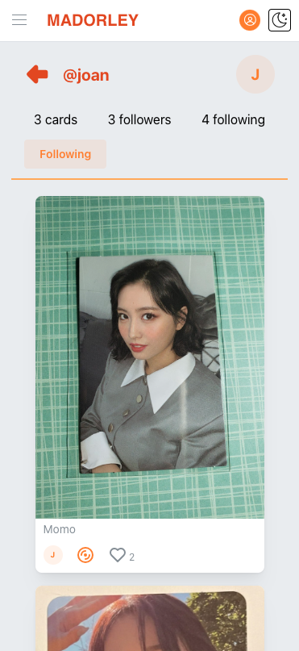

# MADORLEY - Your K-POP Collection

__________________________

 

_______________

MADORLEY is an application for storing and sharing K-Pop photocards. It is deployed at [madorley.com](https://madorley.com). With a responsive design, MADORLEY looks great on mobile devices as well as desktops. The site is open for anyone to create an account, follow others and 'like' photocards. Permissions to upload new photos are granted only on request.  

This is a fullstack application I built to get more hands-on experience with Python and React. After years of being an Engineering Manager, I let my technical skills go soft. Building MADORLEY has allowed me to gain fresh experience with both backend and frontend development, along with deployment on AWS.  

## Backend

* [Python](https://www.python.org/)
* [FastAPI](https://fastapi.tiangolo.com/)
* [SQLAlchemy](https://www.sqlalchemy.org/)
* [Alembic](https://alembic.sqlalchemy.org/)
* [PostgreSQL](https://www.postgresql.org/)

## Frontend

* [React](https://react.dev/)
* [Typescript](https://www.typescriptlang.org/)
* [Vite](https://vitejs.dev/)
* [Mantine](https://mantine.dev/)
* [TanStack Query](https://tanstack.com/query/)
* [Axios](https://axios-http.com/)
* [React Router](https://reactrouter.com/)

## Deployment

* [Docker](https://www.docker.com/)
* [AWS ECS Fargate](https://aws.amazon.com/ecs/)
* [AWS Route53](https://aws.amazon.com/route53/)
* [AWS Certificate Manager](https://aws.amazon.com/certificate-manager/)
* [AWS S3](https://aws.amazon.com/s3/)
* [ElephantSQL](https://www.elephantsql.com/)

## Screen Shots

